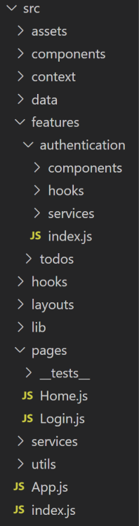

# Structure React Front-End

# Structure React Back-End

react-project
├── api
│   ├── services
│   │   ├── Job.js
│   │   ├── User.js
│   ├── auth.js
│   └── axios.js
├── components
│   ├── Job
│   │   ├── Description.js
│   │   └── Preview.js
│   └── User
│   │   ├── Card.js
│   │   ├── Create.js
│   │   └── List.js
├── i18n
│   ├── de.json
│   └── en.json
├── modules
│   ├── logger.js
│   └── session.js
├── pages
│   ├── Home
│   │   ├── components
│   │   │   ├── Dashboard.js
│   │   │   └── Welcome.js
│   │   └── index.js
│   ├── Login.js
│   └── Profile.js
├── stores
│   ├── language.js
│   └── user.js
├── tests
│   ├── language.test.js
│   └── utils.test.js
├── utils
│   ├── hooks
│   │   ├── useChat.js
│   │   ├── useOutsideAlerter.js
│   │   ├── useToast.js
│   ├── providers
│   │   ├── HomeContextProvider.js
│   │   ├── ToastContextProvider.js
│   ├── colors.js
│   ├── constants.js
│   ├── index.js
├── index.js
├── main.js
└── style.css